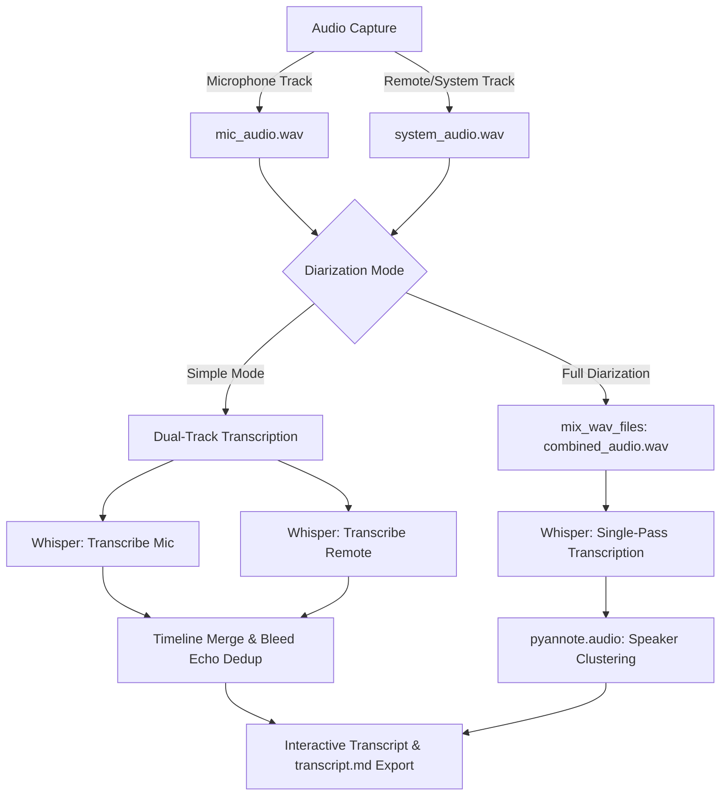

# TalkTrack

Record, transcribe, and identify speakers from your calls — all locally on your machine. Free and open-source alternative to Evaer, Otter.ai, and Fireflies.

TalkTrack is a Windows desktop app for **recording and transcribing Microsoft Teams calls, Zoom meetings, Google Meet sessions**, and any other audio app. It uses [Faster Whisper](https://github.com/SYSTRAN/faster-whisper) for local speech-to-text and [pyannote.audio](https://github.com/pyannote/pyannote-audio) for speaker identification. Everything runs offline — no cloud services, no subscriptions, no data leaves your PC.


> [!IMPORTANT]
> **100% Offline & Private by Default:**
> - Audio recording, transcription (Whisper), and speaker diarization (pyannote) run strictly on your local CPU/GPU.
> - No audio or transcripts are uploaded to any cloud server unless you explicitly configure an external AI provider (Claude, OpenAI, Gemini, etc.) in Settings.

---

## 📑 Table of Contents

- [Why TalkTrack?](#why-talktrack)
- [Features](#features)
- [Quick Start](#quick-start)
  - [Prerequisites](#prerequisites)
  - [Install & Run](#install--run)
  - [GPU Acceleration (NVIDIA, Optional)](#gpu-acceleration-nvidia-optional)
  - [Speaker Diarization Setup (Optional)](#speaker-diarization-optional)
  - [Optional: MP3 Export (FFmpeg)](#optional-mp3-export-ffmpeg)
- [Usage](#usage)
- [CLI & Scheduling](#cli--scheduling)
  - [Command Line Launch](#1-launching-from-the-command-line)
  - [Windows Task Scheduler](#2-scheduling-automated-runs-windows-task-scheduler)
  - [PowerShell Wrapper Script](#3-powershell-launcher-script-launchps1)
- [How Transcription Works](#how-transcription-works)
  - [Whisper Models](#whisper-models)
  - [CPU vs GPU](#cpu-vs-gpu)
- [Speaker Diarization](#speaker-diarization)
- [AI Assistant (Optional)](#ai-assistant-optional)
- [Export Formats](#export-formats)
- [Settings Reference](#settings)
- [Troubleshooting & FAQs](#troubleshooting--faqs)
- [Project Structure](#project-structure)
- [Running Tests](#running-tests)
- [Tech Stack](#tech-stack)
- [Credits & License](#credits--license)

---

## Why TalkTrack?

- **No cloud uploads** — your meeting recordings and transcripts stay on your machine
- **No subscriptions** — free and open-source, no monthly fees like Otter.ai or Fireflies
- **Works with any app** — Microsoft Teams, Zoom, Google Meet, Discord, Slack huddles, WebEx, or any app that plays audio
- **Per-app capture** — on Windows 11, record only your call app without picking up Spotify or YouTube in the background
- **AI-powered** — state-of-the-art Whisper speech recognition + pyannote speaker diarization, running locally on your hardware

---

## Features

- **Record calls** with Record / Pause / Resume / Stop controls, live timer, and level meters
- **Per-app audio capture** (Windows 11) — pick specific apps like Teams or Chrome
- **System audio capture** (Windows 10+) — WASAPI loopback for all system audio
- **Dual-channel recording** — microphone + system/app audio captured separately
- **Auto-stop recording** — detects when your call app goes inactive and offers to stop
- **Auto-start recording** — optionally start recording when a selected app joins a call (Settings > General)
- **Local transcription** — Faster Whisper (OpenAI Whisper), no internet required
- **Speaker diarization** — two modes:
  - *Simple* (no setup): labels "You" vs "Remote" from mic vs system channels
  - *Full* (pyannote.audio): identifies individual speakers with a free HuggingFace token
- **AI assistant** — optional AI-powered meeting summaries, action items, and transcript chat (supports Claude, OpenAI, Grok, Gemini, Mistral, or local models)
- **Per-provider AI settings** — API keys and models stored separately per provider, switch without losing config
- **Manual AI generation** — generate or regenerate summaries and action items on demand
- **Notes in AI context** — call notes are included in AI summary and action item generation
- **Interactive transcript** — click any segment to replay its audio, edit text inline, assign speaker names
- **Play All** — sequential playback of the full transcript with real-time line highlighting and auto-scroll
- **Export** to TXT, SRT (subtitles), or JSON
- **Call notes** with timestamp insertion
- **Tagging system** — create, manage, rename, recolor, and delete custom tags; assign and unassign tags from recordings at any moment
- **Auto-tagging & Retag Suggestions** — automatically apply tags from past recordings with matching names, or get prompted to retag if already assigned
- **Post-recording tag prompt** — optional instant tag prompt banner when a recording finishes
- **Recording browser** — browse, replay, search/filter by name/date/tag, and bulk-delete past recordings (multi-select with Ctrl/Shift+click)
- **Hidden devices filter** — hide unwanted audio devices (e.g., Voicemeeter) from dropdowns via Settings
- **Remembers capture settings** — capture mode and selected apps persist across sessions
- **Min recording length** — automatically discard recordings shorter than a configurable threshold (Settings > General)
- **Custom app icon** — first-run Start Menu shortcut (targeting the venv) gives the correct Windows taskbar icon
- **Collapsible audio sources** — compact UI with expandable source selector
- **GPU/CUDA detection** — System Status panel detects your GPU and guides CUDA setup
- **File logging** — all errors logged to `~/.talktrack/talktrack.log` with crash dialog
- **Bug reporting** — submit issues directly from the app via pre-filled GitHub issues
- **Dark theme** UI (Catppuccin Mocha palette)
- **Guided setup wizard** for HuggingFace / pyannote configuration
- **Auto-install dependencies** — first launch detects and installs required packages

---

## Quick Start

### Prerequisites

- Windows 10 or 11
- Python 3.10+
- A microphone

### Install & Run

```bash
git clone https://github.com/martinasencio-gm/TalkTrack.git
cd TalkTrack
```

Double-click **`start.bat`**. On first launch it sets up an isolated environment and installs dependencies automatically — no manual steps needed.

> **Note:** Dependencies are installed into a project-local virtual environment (`.venv`), **not** your global Python. This keeps heavy packages like PyTorch and pyannote.audio from polluting or upgrading packages in your system Python.

#### Recommended: [uv](https://docs.astral.sh/uv/)

If [uv](https://docs.astral.sh/uv/getting-started/installation/) is installed, `start.bat` uses it automatically. You can also drive it directly:

```bash
uv sync                 # create .venv and install pinned dependencies from uv.lock
uv run python main.py   # run TalkTrack
```

`uv sync` is reproducible (installs exact versions from `uv.lock`) and fast. By default it installs **CPU** PyTorch, which works on any machine.

#### Without uv (Plain Pip)

If uv isn't installed, `start.bat` automatically falls back to a local `.venv` created with Python's built-in `venv` + `pip`. To do it manually:

```bash
python -m venv .venv
.venv\Scripts\activate
pip install -r requirements.txt
python main.py
```

---

### GPU Acceleration (NVIDIA, Optional)

If you have an NVIDIA GPU, install the CUDA build of PyTorch for significantly faster transcription and diarization:

```bash
uv sync --extra cuda     # CUDA 12.6 build (NVIDIA GPU)
```

*Without uv:*

```bash
pip install torch torchaudio --index-url https://download.pytorch.org/whl/cu126
```

Confirm it worked in **Help > System Status** (GPU Acceleration should show "detected with CUDA 12.6"), then set **Compute Device** to CUDA in **Settings > Transcription**.

> **Windows note:** If `uv sync --extra cuda` fails with `Access is denied (os error 5)`, antivirus is locking the download in uv's cache. Run `uv cache clean` or add `%LOCALAPPDATA%\uv\cache` to antivirus exclusions.

---

### Speaker Diarization Setup (Optional)

For multi-speaker identification (Speaker 0, Speaker 1, etc.), TalkTrack uses `pyannote.audio` which requires a free HuggingFace account:

1. Create a free account at [huggingface.co/join](https://huggingface.co/join).
2. Accept the model license at [pyannote/speaker-diarization-community-1](https://huggingface.co/pyannote/speaker-diarization-community-1).
3. Create a read access token at [huggingface.co/settings/tokens](https://huggingface.co/settings/tokens).
4. Paste the token into the first-run wizard or in **Settings > Transcription > HuggingFace Token**.

*Without this setup, TalkTrack continues to work — it uses Simple Mode, labeling speakers cleanly as "You" and "Remote".*

---

### Optional: MP3 Export (FFmpeg)

By default, audio is saved as uncompressed WAV. To enable MP3 encoding:

1. Install FFmpeg using Windows Package Manager:
   ```powershell
   winget install Gyan.FFmpeg
   ```
2. In TalkTrack, open **Settings > General** and change **Audio Format** to `MP3`.

---

## Usage

1. Start your call in Teams, Zoom, Google Meet, or Discord.
2. In TalkTrack, select your microphone and the app/output to capture.
3. Click **Record** (or enable auto-record in Settings to start automatically when a call begins).
4. When finished, click **Stop** — transcription begins automatically.
5. Review the transcript, assign speaker names, use **Play All** to follow along, and export.

**Windows 11:** Select specific apps (Teams, Chrome, etc.) in the app picker to record only their audio.

**Windows 10:** Captures all system audio via WASAPI loopback.

---

## CLI & Scheduling

### 1. Launching from the Command Line

Launch the TalkTrack GUI:
```powershell
.venv\Scripts\python.exe main.py
```

Run unattended headless batch transcription:
```powershell
.venv\Scripts\python.exe batch_transcribe.py --until 07:00
```

| Parameter | Description |
|---|---|
| `--until TIME` | **Required.** Latest time a *new* job may start (e.g. `07:00` or `YYYY-MM-DDTHH:MM`). In-progress jobs finish cleanly. |
| `--diarize` / `--no-diarize` | Force speaker diarization on/off (overrides saved setting). |
| `--limit N` | Process at most N queued recordings. |
| `--dry-run` | List what would be processed without transcribing. |
| `--verbose` | Output detailed DEBUG logs. |

---

### 2. Scheduling Automated Runs (Windows Task Scheduler)

Schedule TalkTrack to transcribe all queued recordings every night between 11:00 PM and 7:00 AM:

```cmd
schtasks /Create /TN TalkTrackBatch /SC DAILY /ST 23:00 /TR "\"C:\path\to\TalkTrack\.venv\Scripts\pythonw.exe\" \"C:\path\to\TalkTrack\batch_transcribe.py\" --until 07:00"
```

Logs are written automatically to `Documents\TalkTrack\batch Log\batch_<timestamp>.log`.

---

### 3. PowerShell Launcher Script (`launch.ps1`)

Create a quick PowerShell launcher in the repo root:

```powershell
# launch.ps1
param(
    [switch]$Batch,
    [string]$Until = "07:00"
)

$VenvPython = "$PSScriptRoot\.venv\Scripts\python.exe"

if ($Batch) {
    & $VenvPython "$PSScriptRoot\batch_transcribe.py" --until $Until
} else {
    & $VenvPython "$PSScriptRoot\main.py"
}
```

Run with:
```powershell
.\launch.ps1         # Launch GUI
.\launch.ps1 -Batch  # Run batch transcription
```

---

## How Transcription Works

TalkTrack uses [Faster Whisper](https://github.com/SYSTRAN/faster-whisper), a CTranslate2-optimized implementation of OpenAI Whisper. Everything runs locally on your PC.

### Pipeline



### Whisper Models

Choose a model in **Settings > Transcription** based on your speed and accuracy requirements:

| Model | Disk Size | Speed | Accuracy | Approx. VRAM (GPU) |
|---|---|---|---|---|
| `tiny` | ~75 MB | ⚡ Fastest | Basic | ~1 GB |
| `base` | ~145 MB | 🚀 Fast | Good | ~1 GB |
| `small` | ~480 MB | ⚖ Balanced | Better (Recommended) | ~2 GB |
| `medium` | ~1.5 GB | 🔍 Thorough | Great | ~5 GB |
| `large-v3` | ~3.0 GB | 🎯 Precision | Best | ~10 GB |

Models download automatically on first use and remain cached locally.

### CPU vs GPU

- **CPU** (`int8` quantization) — Works on all hardware without extra configuration.
- **CUDA** (`float16`) — Accelerated processing on NVIDIA GPUs. Select "CUDA (NVIDIA GPU)" in Settings > Transcription > Compute Device.

---

## Speaker Diarization

### Simple Mode (No Setup)
Transcribes microphone and system channels separately and assigns **"You"** and **"Remote"** labels while filtering out acoustic echo and mic bleed. Ideal for 1-on-1 calls.

### Full Diarization (pyannote.audio)
Uses the `pyannote.audio 4.0` neural pipeline to cluster individual voices (`SPEAKER_00`, `SPEAKER_01`, etc.) across any number of meeting participants.

---

## AI Assistant (Optional)

TalkTrack connects to external or local AI providers to generate structured meeting summaries, extract action items with assignees, and chat with transcript context.

| Provider | Supported Models | Required Package |
|---|---|---|
| **Claude** (Anthropic) | `claude-sonnet-4-6`, `claude-haiku-4-5`, `claude-opus-4-6` | `anthropic` |
| **OpenAI** | `gpt-4o`, `gpt-4o-mini`, `gpt-4-turbo` | `openai` |
| **Grok** (xAI) | `grok-3`, `grok-3-mini`, `grok-2` | `openai` |
| **Google Gemini** | `gemini-2.5-flash`, `gemini-2.5-pro`, `gemini-2.0-flash` | `google-generativeai` |
| **Mistral AI** | `mistral-large-latest`, `mistral-small` | `mistralai` |
| **Local GGUF** | Any local GGUF model via llama-cpp-python | `llama-cpp-python` |

SDK packages are installed automatically when you choose a provider in **Settings > AI Assistant**, or pre-installed via extras:

```bash
uv sync --extra claude       # or: openai, grok, gemini, mistral, local, all-ai
```

---

## Export Formats

Each recording session generates persistent artifacts inside its own session folder (`recordings/recording_YYYYMMDD_HHMMSS/`):

| Format / File | Description |
|---|---|
| `transcript.md` | **LLM-ready Markdown export** with YAML frontmatter, meeting metadata, summary, action items, call notes, and transcript. |
| `transcript.json` | Complete structured JSON with start/end timestamps, confidence ratings, and speaker labels. |
| `transcript.txt` | Formatted plain text with timestamps and speaker names. |
| `transcript.srt` | Subtitle file format compatible with video players and editors. |
| `summary.md` | AI-generated meeting summary. |
| `action_items.json` | Extracted action items with assigned owners. |

---

## Settings

Access configuration via the gear icon or **Edit > Settings**:

| Setting | Options | Default |
|---|---|---|
| **Whisper Model** | `tiny`, `base`, `small`, `medium`, `large-v3` | `base` |
| **Compute Device** | `CPU`, `CUDA (NVIDIA GPU)` | `CPU` |
| **Language** | `Auto-detect` or ISO code (`en`, `es`, `de`, etc.) | `Auto-detect` |
| **Sample Rate** | `16000`, `22050`, `44100`, `48000` Hz | `16000` Hz |
| **Output Format** | `WAV`, `MP3` (requires FFmpeg) | `WAV` |
| **Capture Mode** | `Selected apps` (Win11) or `All system audio` | Auto-detected |
| **Diarization** | `Enabled`/`Disabled`, min/max speaker counts | `Disabled` |
| **AI Provider** | `None`, `Claude`, `OpenAI`, `Grok`, `Gemini`, `Mistral`, `Local` | `None` |
| **Min Recording Length** | Discard recordings shorter than N seconds | `5s` |
| **Prompt for Tags** | Show quick tagging banner when recording stops | `Enabled` |
| **Auto-Tag by Name** | Copy tags from previous recordings with same name | `Enabled` |
| **Silence Auto-Stop** | Stop recording after sustained silence | `Enabled (120s)` |
| **Hidden Devices** | Filter out unwanted virtual audio devices | `None` |

---

## Troubleshooting & FAQs

### Why is audio silent when recording Teams or Zoom in per-app mode?
Conferencing applications (Microsoft Teams, Zoom, WebEx) set privacy flags on their call audio streams that opt out of Windows 11 per-process loopback. Switch TalkTrack's capture mode to **"All system audio"** to capture call audio via the endpoint loopback.

### How do I fix "CUDA selected but not available"?
Install PyTorch with CUDA 12.6 support:
```powershell
uv sync --extra cuda
# or: pip install torch torchaudio --index-url https://download.pytorch.org/whl/cu126
```

### Why is the taskbar icon showing the default Python logo?
Launch TalkTrack from the Start Menu shortcut created via **Help > Add to Start Menu**. This links directly to the virtual environment binary and registers the correct AppUserModelID.

---

## Project Structure

```
TalkTrack/
├── main.py                     # Entry point, single-instance guard, logging
├── batch_transcribe.py         # Headless batch CLI entry point (Task Scheduler)
├── start.bat                   # Launcher (uv-first, .venv isolation, pip fallback)
├── start_debug.bat             # Debug launcher with console output
├── pyproject.toml              # Project metadata and pinned dependencies
├── uv.lock                     # Lockfile for reproducible builds
├── requirements.txt            # Plain-pip dependencies
├── resources/                  # Stylesheets, icons, and logo assets
│   ├── style.qss               # Dark theme stylesheet (Catppuccin Mocha)
│   └── talktrack.ico           # Application icon
├── docs/                       # Documentation and scheduling guides
│   └── batch-transcription.md  # Batch CLI usage & Task Scheduler guide
├── app/
│   ├── main_window.py          # Main window orchestration & UI
│   ├── audio/                  # Audio clip playback (SegmentPlayer)
│   ├── batch/                  # Scheduled batch runner and pipeline
│   ├── integrations/           # Outlook desktop calendar COM integration
│   ├── recording/              # WASAPI loopback, Win11 COM, ChunkWriter
│   ├── transcription/          # Faster Whisper, track merging, pyannote diarizer
│   ├── ai/                     # AI providers (Claude, OpenAI, Gemini, Mistral, Local)
│   ├── ui/                     # Modular PyQt6 UI components
│   └── utils/                  # Config, session I/O, device discovery, COM poller
├── tests/                      # Automated test suite
└── recordings/                 # Output recording directory
```

---

## Running Tests

Run the full automated test suite using the virtual environment interpreter:

```powershell
.venv\Scripts\python.exe -m pytest tests/ -q
```

---

## Tech Stack

| Component | Library |
|---|---|
| **GUI Framework** | PyQt6 |
| **Audio Capture** | `sounddevice`, WASAPI Loopback, `comtypes` (Win11 Per-Process COM) |
| **Audio Session Polling** | `pycaw`, `psutil` (isolated in background helper process) |
| **Speech-to-Text** | `faster-whisper` (OpenAI Whisper via CTranslate2) |
| **Speaker Diarization** | `pyannote.audio 4.0` |
| **Deep Learning** | PyTorch (`torch`, `torchaudio`) |
| **Audio DSP & I/O** | `soundfile`, `scipy`, `pydub`, `numpy` |
| **Windows Integration** | `pywin32`, `comtypes`, Windows Shell APIs |
| **AI Integrations** | `anthropic`, `openai`, `google-generativeai`, `mistralai`, `llama-cpp-python` |

---

## Credits & License

- **Speech Recognition:** [Faster Whisper](https://github.com/SYSTRAN/faster-whisper) by SYSTRAN / OpenAI Whisper
- **Speaker Diarization:** [pyannote.audio](https://github.com/pyannote/pyannote-audio) by Hervé Bredin
- **Theme Palette:** [Catppuccin Mocha](https://github.com/catppuccin/catppuccin)
- **License:** Released under the [MIT License](LICENSE).
